### 1. Install R {#install-R}

Visit [cloud.r-project.org](https://cloud.r-project.org/) to download the most recent version of R for your operating system. You should have *at least* version 4.4.0 (released 2024-04-24) running when you start MEDS.

### 3. Install Positron {#install-Positron}

While R is a programming language, Positron is a software application (often referred to as an IDE, **I**ntegrated **D**evelopment **E**nvironment) that provides a user-friendly workspace for writing and running code. In addition to R, Positron also supports Python and other programming languages, making it a flexible tool for data science and scientific computing. If you've used RStudio in the past, you'll notice a lot of similar features in Positron (it was created by the company behind RStudio, Posit!), as well as improved support for multiple languages and newer development tools.

To install Positron, visit [positron.posit.co/install](https://positron.posit.co/install.html) and follow the instructions. If you already have Positron installed, it'll automatically check for updates from Posit's channel of monthly releases and install the new version in the background. To open Positron, click on the app logo that looks like:

```{r}
#| echo: false
#| fig-align: "center"
#| out-width: "15%"

```

### 2. Install Command Line Tools & XQuartz (Mac only)

 Mac users should install the following tools, which are required for some R package installations:

-   **Command Line Tools:** Run `xcode-select --install` in the Positron Terminal
-   **XQuartz:** Download from [xquartz.org](https://www.xquartz.org/){target="_blank"}

* Windows users: Command Line Tools are pre-installed and XQuartz is not required.*

### 4. Install VS Code {#install-vscode}

Visual Studio Code (aka VS Code) is another language-agnostic IDE. It works and looks a lot like Positron (Positron is actually built off VS Code), and is still widely-used by many Python developers. You'll practice using VS Code in some of your classes as well. [Download VS Code for your operating system](https://code.visualstudio.com/download).

```{r}
#| echo: false
#| fig-align: "center"
#| out-width: "15%"
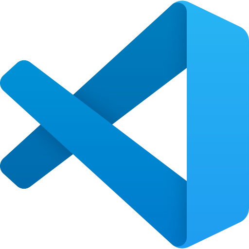
```

### 4. Check for git {#check-git}

You should already have git on your device, but let’s check for it anyway.

-   Open RStudio

-   In the Terminal, run the following command (choose the option for your operating system):

::: panel-tabset
##  Mac

```{bash filename="RStudio Terminal"}
#| eval: false
which git
```

##  Windows

```{bash filename="RStudio Terminal"}
#| eval: false
where git
```
:::

-   If you get something that looks like a file path to git on your computer (e.g. `/usr/local/bin/git` on a Mac, `C:\Program Files\Git\mingw64\bin\git.exe` on Windows, though it could differ slightly on your computer), then you have git installed. If you instead get no response at all, you should download & install git here: [git-scm.com/downloads](https://git-scm.com/downloads)

::: callout-note
## **An aside:** We'll be using git *a lot* throughout MEDS.

GitHub's [Git Guides](https://github.com/git-guides) are a really wonderful resource to refer to!
:::

### 5. Create a GitHub account {#GitHub}

-   If you don’t already have a GitHub account, go to <https://github.com> and create one. Check out Jenny Bryan's [Happy Git with R, Ch. 4](https://happygitwithr.com/github-acct.html) for some helpful considerations when choosing a username. We suggest that you use a *personal email* or your @bren.ucsb.edu email when setting up your account (rather than your @ucsb.edu *email*, which will be deactivated after you graduate).

### 6. Configure git {#configure-git}

-   In RStudio, open the Terminal. Run the following commands (by pressing **return** after each line). Be sure to replace the username (keep the quotation marks!) with *your* GitHub username and the email with the email you used for your GitHub account.

```{bash filename="RStudio Terminal"}
#| eval: false
git config --global user.name "Jane Doe"
git config --global user.email janedoe@example.com
```

-   Then, in the Terminal run the following, and carefully check that the name and email returned match your GitHub information:

```{bash filename="RStudio Terminal"}
#| eval: false
git config --list --global
```

::: callout-important
## IMPORTANT: If you're configuring git on a **Bren server** (e.g. workbench-1.bren.ucsb.edu or workbench-2.bren.ucsb.edu), you must also run the following in the Terminal

```{bash filename="RStudio Terminal"}
#| eval: false
git config --global credential.helper 'cache --timeout=10000000'
```

This prevents important credentials (e.g. a GitHub Personal Access Token, PAT, which you'll set in step #7) from being removed from the server's memory. You **do not** need to complete this step when configuring git on your local computer.
:::

### 7. Store your GitHub personal access token (PAT) {#GitHub-PAT}

**First:** What even is a personal access token? From GitHub's documentation:

> Personal access tokens (PATs) are an alternative to using passwords for authentication to GitHub when using the [GitHub API](https://docs.github.com/en/rest/overview/other-authentication-methods#via-oauth-and-personal-access-tokens) or the [command line](https://docs.github.com/en/authentication/keeping-your-account-and-data-secure/creating-a-personal-access-token#using-a-token-on-the-command-line).

This means that in order to push your work (files, scripts, etc.) from your laptop (or any other computer) to GitHub, you'll need to first to generate a PAT. **Importantly, you'll need to generate a PAT for each computer you wish to work from.** For example, we will complete the following steps to create a PAT for your personal laptop, but you'll also need to create a PAT if/when you choose to work on a second computer at home or any of the Bren servers. Good news is that you can follow these same steps when you're ready to set up additional PATs on other machines. For now, let's get a PAT for our personal laptop squared away:

-   Once you have git configured successfully, install the `{usethis}` package in R by running the following in the RStudio Console:

```{r filename="RStudio Console"}
#| eval: false
install.packages(“usethis”)
```

A lot of scary looking red text will show up while this is installing - don’t panic. If you get to the end and see something like below (with no error) it’s installed successfully.

```{r}
#| echo: false
#| fig-align: "center"
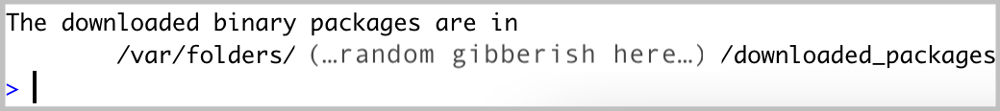
```

-   Run the following in the RStudio Console:

```{r filename="RStudio Console"}
#| eval: false
usethis::create_github_token() 
```

-   Enter your GitHub password if/when prompted. You’ll be taken to a screen that looks like this:

```{r}
#| echo: false
#| fig-align: "center"
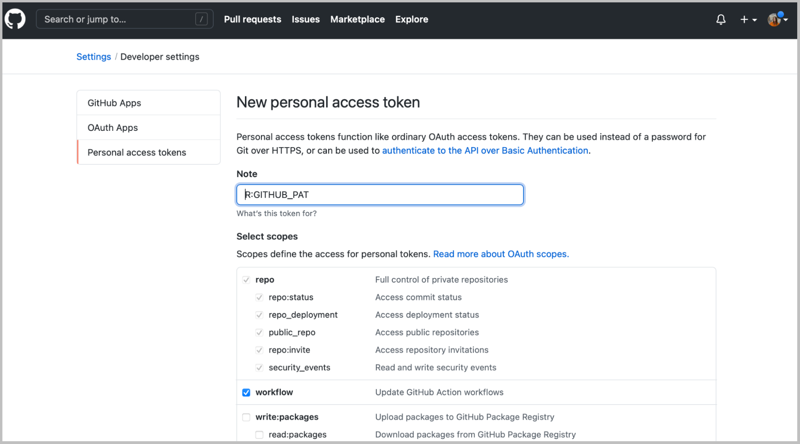
```

-   In the **Note** field, you should see some autopopulated text: `R:GITHUB_PAT`. We suggest changing this to something that signifies what machine it's being used for. For example, if you are generating a PAT for your laptop, you might choose to rename it, `My Personal Laptop`.

-   Next, you'll see a section called **Select scopes** with reasonable options already selected for you. Do not change anything. Just scroll down to the bottom of that page and click the green **Generate token** button:

```{r}
#| echo: false
#| fig-align: "center"
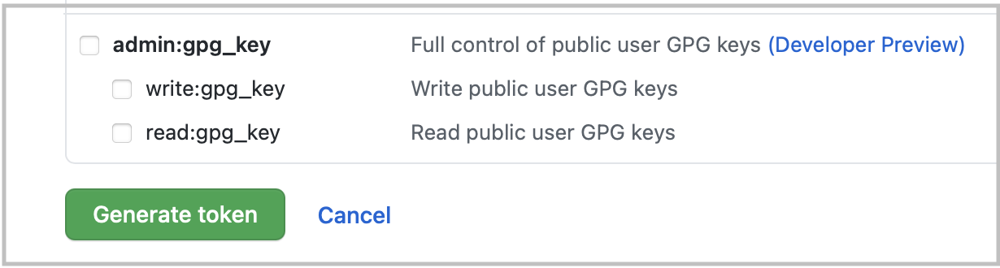
```

-   Copy the generated PAT to your clipboard

-   Back in RStudio, run the following in the Console:

```{r filename="RStudio Console"}
#| eval: false
gitcreds::gitcreds_set()
```

This will prompt you to paste the PAT you just copied from GitHub. Paste the PAT, press Enter to run. You should see something like this show up if all is well so far (you’ll have pasted your PAT where the example below says “REDACTED”):

```{r}
#| echo: false
#| fig-align: "center"
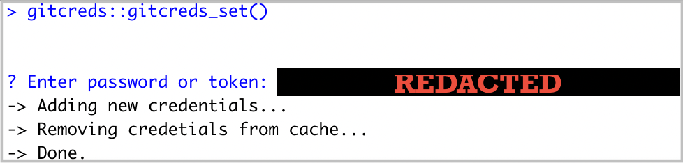
```

-   In the RStudio Console, run:

```{r filename="RStudio Console"}
#| eval: false
usethis::git_sitrep()
```

Does it return information about your connected GitHub account that looks something like below? Great! You’ve configured git and successfully stored your PAT.

```{r}
#| echo: false
#| fig-align: "center"
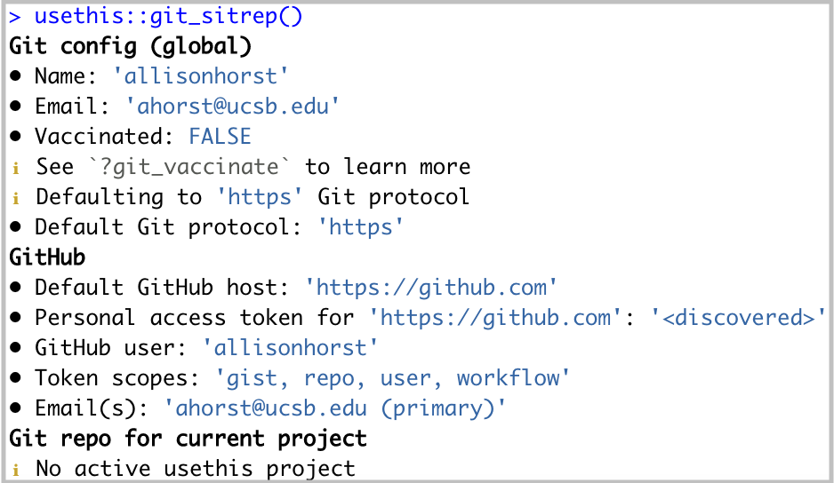
```

::: callout-note
## **A note on expiring tokens:**

Setting an expiration date on personal access tokens is highly recommended in order to keep your information secure. GitHub will send you an email when it's time to regenerate a token that's about to expire. Follow the email prompts, then use `gitcreds::gitcreds_set()` to reset your token.
:::

### 8. Install Anaconda {#install-Anaconda}

Anaconda is a distribution of the Python and R programming languages that aims to simplify package management and deployment. You'll need to download the Graphical Installer, which provides a graphical user interface (GUI) to facilitate writing code. Choose the option for your operating system:

::: panel-tabset
##  Mac

Click here to download Graphical Installer for MacOS:

-   [For Apple Silicon Chip (M1, M2, etc.)](https://repo.anaconda.com/archive/Anaconda3-2025.06-0-MacOSX-arm64.pkg)

-   [For Intel Chip](https://repo.anaconda.com/archive/Anaconda3-2025.06-0-MacOSX-x86_64.pkg)

This might pop open a new tab with a “redirecting you to…” phrase, but Anaconda should be downloading at the same time. It might take a couple minutes. After it’s downloaded, click it and hit Allow if you see the following:

```{r}
#| echo: false
#| fig-align: "center"
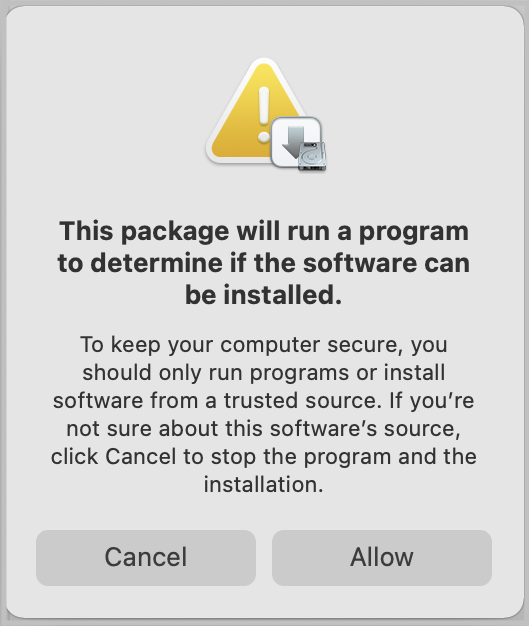
```

Follow the installation steps to complete Anaconda installation. You will accept all default settings.

##  Windows

[Click here to download the 64-bit Graphical Installer Anaconda for Windows](https://repo.anaconda.com/archive/Anaconda3-2024.02-1-Windows-x86_64.exe). Run the executable to install, which will look something like this:

```{r}
#| echo: false
#| out-width: "100%"
#| fig-align: "center"
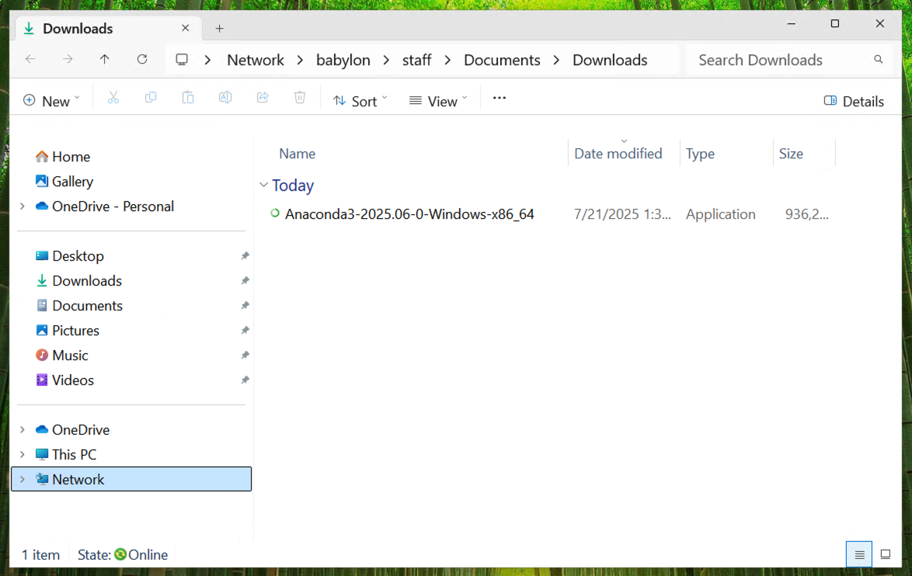
```

Make sure to install Anaconda for "All Users" like this:

```{r}
#| echo: false
#| out-width: "100%"
#| fig-align: "center"
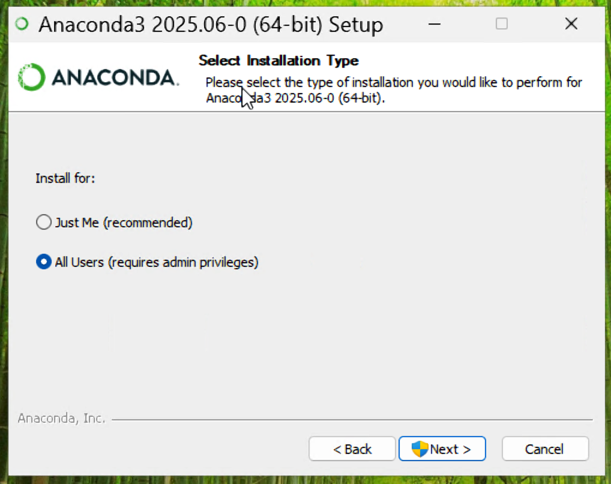
```

It is important that Anaconda is installed in the Program Data folder located in your C: drive. It should look like this:

```{r}
#| echo: false
#| out-width: "100%"
#| fig-align: "center"
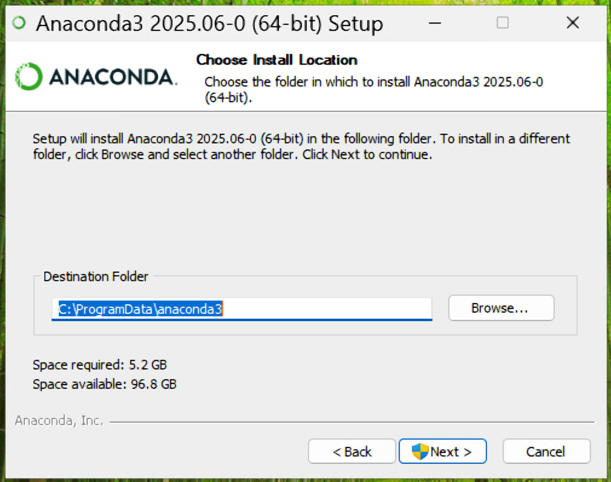
```

You'll want to register Anaconda3 as your system Python and clear your cache when the installation is complete. Select those boxes and then install Anaconda:

```{r}
#| echo: false
#| out-width: "100%"
#| fig-align: "center"
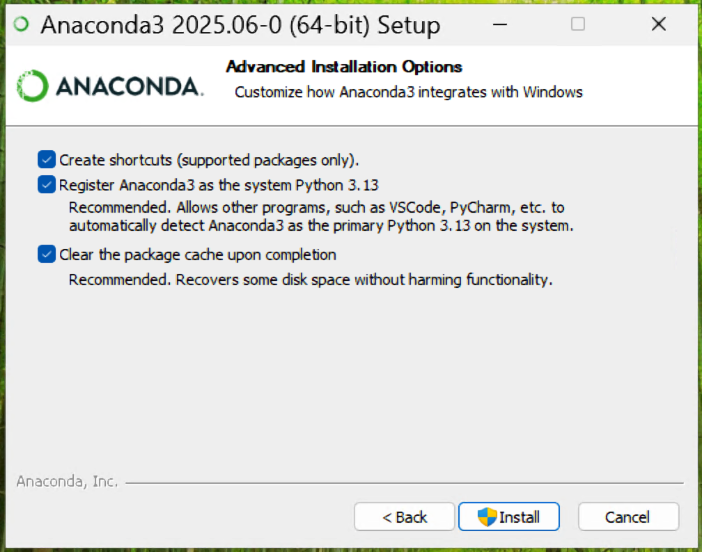
```
:::

:::: callout-important
## IMPORTANT: Check that Anaconda is installed properly.

By default, installation should add "conda" to your system path so you should not have any issues. Run the following to confirm:

```{bash filename="RStudio Terminal"}
#| eval: false
conda info
```

-   If it returns any information, you're all set.

-   If it returns "bash: conda: command not found", conda was not added to your system path. You'll need to modify your shell profile to add conda to your system path by following the steps below.

#### Troubleshooting steps

::: panel-tabset
##  Mac

Run the following to initialize conda, which will add "conda" to your shell profile:

```{bash filename="RStudio Terminal"}
#| eval: false

~/opt/anaconda3/bin/conda init 

```

It should return a list of modifications. If successful, move onto the next commands:

```{bash filename="RStudio Terminal"}
#| eval: false

source ~/.bash_profile
conda
```

If it returns any information, you're all set. If it still doesn't recognize it, ask for help.

##  Windows

Run the following to initialize conda, which will add "conda" to your shell profile:

```{bash filename="RStudio Terminal"}
#| eval: false

/c/ProgramData/anaconda3/Scripts/conda.exe init bash

```

It should return a list of modifications. If successful, move onto the next commands:

```{bash filename="RStudio Terminal"}
#| eval: false

source ~/.bash_profile
conda
```

If it returns any information, you're all set. If it still doesn't recognize it, ask for help.

:::
::::

### 10. Install Cyberduck {#install-Cyberduck}

Cyberduck is a program that allows you to browse files on a remote server. [Download here](https://cyberduck.io/).

### 11. Install UCSB's Ivanti Campus VPN (Virtual Private Network) {#install-VPN}

For secure remote access to the UCSB's campus network when you're not physically present on campus, you'll need to download and install the Ivanti VPN client. This will allow you to access UCSB's technology resources (including servers, journal subscriptions, etc.) anytime and from anywhere.

See this [UCSB Information Technology article](https://it.ucsb.edu/network-infrastructure-services/ivanti-connect-secure-campus-vpn) for directions on how to get started.

### 12. Create your Slack account and join MEDS {#Slack}

-   [Click here](https://join.slack.com/t/ucsb-meds/shared_invite/zt-so8oh7xf-w41bSnbBWAiMOXKPf5j_qw) to join our UCSB-MEDS Slack Workspace

-   Customize your profile with your name and photo (adding a photo helps instructors and TAs learn your names more quickly!).

-   Join the summer course channels (`#eds-212`, `#eds-221`, `#eds-214`, `#eds-217`)

<!-- - ~~Read through the [Slack Resource Guide](https://ucsb-meds.github.io/meds-slack.html)~~ -->

### 13. Access Google apps through your @ucsb.edu account {#Google-apps}

Once enrolled and your UCSBnetID is activated, you will have access to your [UCSB Connect Account](https://www.connect.ucsb.edu/usage) which provides email, calendaring, and collaboration services. *You must use this account (UCSBnetID\@ucsb.edu) to log in and access all of your Google Apps (including Google Calendar, Google Drive, etc.).*

The [**MEDS Google Calendar**](https://calendar.google.com/calendar/u/0/embed?src=c_1886ai526iqschc9mnpj6cu753n60@resource.calendar.google.com&ctz=America/Los_Angeles) contains all classes and events relevant for our MEDS students. Feel free to add this to your calendar if you find it helpful. To do so, log in to [Google Calendar](https://www.google.com/calendar) using your @ucsb.edu credentials \> Click on the `+` next to "Other calendars" on the left-hand side of your screen and choose "Browse resources" \> Click the drop down arrow next to "bren" and check the box next to "bren-calendar-meds"

### 14. Request key card access to Bren / NCEAS {#Access-IDs}

New students must [request an Access ID Card](https://www.accessid.ucsb.edu/) (aka your UCSB photo identification), which are available for pickup at the [UCEN](https://www.ucen.ucsb.edu/) 24 hours after your request is made. We recommend submitting your request before summer orientation, so that it's ready for pickup during your first day on campus.

Once you receive your Access ID Card, you must complete [this form](https://bren.formstack.com/forms/buildingsecurity) to gain key card access to Bren (after hours) and NCEAS (all hours).

<br>

::: {.center-text .body-text-l .dark-blue-text}
***\~ END Installation Guide \~***
:::

<br>